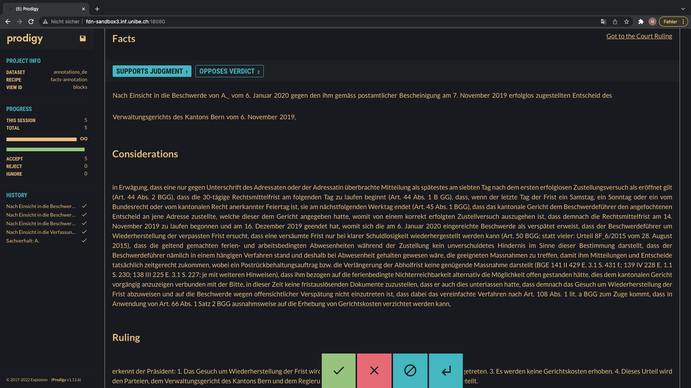

# Biweekly progress Report 2 (15.03.22)
## What did you work on the last two weeks?
### Prodigy
- Results are dumped into annotation.db, which is a sqlite Database
- Created the Datasets as JSONL files using [datasetCreation.py](../../datasets/datasetCreation.py), according to the 4 dimensions we discussed:
  - 3 Languages `[DE, FR, IT]`: This dimension distinguishes the datasets (see for example  [german dataset](../../datasets/annotation_input_set_de.jsonl)) and the prodigy task.
When creating the dataset you chose the language and when running your prodigy task you do the same. 
I decided on this approach because each language is a different relation in scrc and to increase the user-friendliness of the prodigy task. This way, the annotators can choose in which language they want to annotate. 
  - 3 legal areas `["penal_law", "social_law", "civil_law"]`. `datasetCreation.py`uses get_legal_area function from main_utils to get the legal area from the chamber.
  - 2 outcomes `[approval, dismissal`] (see ``WHERE`` statement in query, maybe we can improve on this?)
  - 6 years from 2015 to 2021 (the validation and test set)
  ==> One ruling per dimensions 3 (language) * 3 (legal area) * 2 (outcome) * 6 (year) * 1 (number of rulings) = 108 cases divided in 3 datasets of 36 entries
  - To get the "easiest/shortest" cases the query sorts the cases according to their fact length and the ``datasetCreation.py`` filters the cases so that for each `(legal_area, year, judgment)` tuple the shortest one is chosen.
- We have a working prodigy setup fulfilling the basic requirements. The recipe is called facts-annotation, it can be run using the docker setup with `bash run.sh facts-annotation de`
  - It is a span task and takes the language you want to annotate as parameter. It also displays the considerations and rulings as text and display a link to the court document.


### Organisation
- Reading some related literature  on topic
- Getting more familiar with the workflow via docker (I'm slowly but surly getting the hang of it but sometimes still struggling:D)
## What new things are working?
- We can dump the results into an extern DB
- We created our datasets from scrc and can use them as a stream for our recipe
- facts-annotation prodigy setup v1 (big yay)
- Displaying the facts, consideration and rulings in the prodigy interface (was a struggle with an easy solution grr)
## What are you currently working on?
- Getting the correct and good cases, because for now I'm not convinced that my dataset is good.
- I would like to distinguish between the sessions of the law students so they don't have to start each session with the dataset entry one (which is currently the case)
--> How does prodigy do the sessions? Saving session and continue where you started?
- Although the annotated dataset is saved in annotation.db it would be nice to dump it in scrc directly. 
Furthermore, I want to understand the results better and find a way to display them nicley for my future work with the data.
- Reading more on topic --> Starting Asap on Annotation guideline!
- Run prodigy in background, so my sandbox is not blocked :)
## What are your current struggles/problems?
- Some cases may not be that good because we chose the shortest first. 
We also run the risk of filtering especially wrongly split cases out. See example below from the german subset:
```json
{"id": 433618, 
  "text": "Sachverhalt: A. ", 
  "legal_area": "social_law",
  "date": 2019, 
  "link": "https://www.bger.ch/ext/eurospider/live/de/php/aza/http/index.php?lang=de&type=highlight_simple_query&page=41&from_date=29.10.2019&to_date=17.11.2019&sort=relevance&insertion_date=&top_subcollection_aza=all&query_words=&rank=410&azaclir=aza&highlight_docid=aza%3A%2F%2F30-10-2019-8C_469-2019&number_of_ranks=469", 
  "considerations": "A._, geboren 1974, ist diplomierte Psychologin und war ab 15. Oktober 2013 zu 80 % als Mitglied der Abteilung B._ des Kantons Zug t\u00e4tig. Infolge ungen\u00fcgender Arbeitsleistungen versuchte die Pr\u00e4sidentin/Amtsleiterin (nachfolgend: Amtsleiterin) unterst\u00fctzende Massnahmen, wie z.B. ein Coaching, zu ergreifen; zudem wurde der Erlass eines Verweises in Erw\u00e4gung gezogen. Nachdem sich A._ den unterst\u00fctzenden Massnahmen widersetzt und ihre Vorgesetzte wiederholt mit Vorw\u00fcrfen eingedeckt hatte, stellte diese sie am 21. September 2017 superprovisorisch von ihrer Arbeitspflicht frei. Mit Beschluss vom 21. November 2017 k\u00fcndigte der Regierungsrat des Kantons Zug das Arbeitsverh\u00e4ltnis per 28. Februar 2018. B. Das Verwaltungsgericht des Kantons Zug wies die dagegen erhobene Beschwerde mit Entscheid vom 23. Mai 2019 ab. C. A._ l\u00e4sst Beschwerde in \u00f6ffentlich-rechtlichen Angelegenheiten f\u00fchren und beantragen, es sei der vorinstanzliche Entscheid aufzuheben und die Sache zur Gew\u00e4hrung des rechtlichen Geh\u00f6rs und Durchf\u00fchrung des Beweisverfahrens an die Vorinstanz bzw. an den Regierungsrat zur\u00fcckzuweisen. Eventualiter sei der vorinstanzliche Entscheid aufzuheben und ihr eine Entsch\u00e4digung von f\u00fcnf Monatsl\u00f6hnen wegen missbr\u00e4uchlicher K\u00fcndigung im Sinne des Personalgesetzes sowie von sieben zus\u00e4tzlichen Monatsl\u00f6hnen wegen missbr\u00e4uchlicher und diskriminierender K\u00fcndigung im Sinne des Gleichstellungs- und Arbeitsgesetzes auszurichten. Zudem ersucht sie um Sistierung des Verfahrens bis zum Entscheid des Verwaltungsgerichts des Kantons Zug \u00fcber ihr Arbeitszeugnis. Das Bundesgericht f\u00fchrt keinen Schriftenwechsel durch. Erw\u00e4gungen: 1. Die Sachurteilsvoraussetzungen sind erf\u00fcllt, da die Beschwerde unter Einhaltung der gesetzlichen Frist (Art. 100 Abs. 1 BGG) und Form (Art. 42 BGG) von einer durch die Entscheidung besonders ber\u00fchrten Partei mit einem schutzw\u00fcrdigen Interesse an deren Aufhebung oder \u00c4nderung (Art. 89 Abs. 1 BGG) eingereicht wurde und sich das Rechtsmittel gegen einen von einer letzten kantonalen Instanz (Art. 86 Abs. 1 lit. d BGG) gef\u00e4llten Endentscheid (Art. 90 BGG) in einer Angelegenheit des \u00f6ffentlichen Rechts (Art. 82 lit. a BGG) richtet, keine der in Art. 83 BGG erw\u00e4hnten Ausnahmen greift und angesichts der beantragten Entsch\u00e4digung auch der Streitwert von Art. 85 Abs. 1 lit. b BGG erf\u00fcllt ist. 2. 2.1. Das Bundesgericht kann die Sachverhaltsfeststellung der Vorinstanz nur berichtigen oder erg\u00e4nzen, wenn sie offensichtlich unrichtig ist oder auf einer Rechtsverletzung im Sinne von Art. 95 BGG beruht (Art. 105 Abs. 2 BGG). \u00dcberdies muss die Behebung des Mangels f\u00fcr den Ausgang des Verfahrens entscheidend sein (Art. 97 Abs. 1 BGG). Neue Tatsachen und Beweismittel d\u00fcrfen nur so weit vorgebracht werden, als erst der Entscheid der Vorinstanz dazu Anlass gibt (Art. 99 Abs. 1 BGG). Die beschwerdef\u00fchrende Partei, welche die Sachverhaltsfeststellungen der Vorinstanz anfechten will, muss substanziiert darlegen, inwiefern die Voraussetzungen einer Ausnahme gem\u00e4ss Art. 105 Abs. 2 BGG gegeben sind und das Verfahren bei rechtskonformer Ermittlung des Sachverhalts anders ausgegangen w\u00e4re; andernfalls kann ein Sachverhalt, der vom im angefochtenen Entscheid festgestellten abweicht, nicht ber\u00fccksichtigt werden (BGE 140 III 16 E. 1.3.1 S. 18 mit Hinweisen). 2.2. Die Beschwerde in \u00f6ffentlich-rechtlichen Angelegenheiten kann wegen Rechtsverletzung gem\u00e4ss Art. 95 f. BGG, insbesondere wegen Verletzung von Bundesrecht (Art. 95 lit. a BGG), erhoben werden. Die Verletzung kantonaler Bestimmungen bildet - abgesehen von den hier nicht gegebenen F\u00e4llen gem\u00e4ss Art. 95 lit. c-e BGG - nur dann einen zul\u00e4ssigen Beschwerdegrund, wenn eine derartige Rechtsverletzung einen Verstoss gegen Bundesrecht im Sinne von Art. 95 lit. a BGG oder gegen V\u00f6lkerrecht im Sinne von Art. 95 lit. b BGG zur Folge hat (BGE 140 I 320 E. 3.1 mit Hinweisen). Das Bundesgericht wendet das Recht von Amtes wegen an (Art. 106 Abs. 1 BGG). Es pr\u00fcft die Verletzung von Grundrechten und von kantonalem und interkantonalem Recht nur insofern, als eine solche R\u00fcge in der Beschwerde vorgebracht und begr\u00fcndet worden ist (Art. 106 Abs. 2 BGG). 2.3. Eine willk\u00fcrliche Anwendung kantonalen Rechts liegt vor, wenn der angefochtene Entscheid offensichtlich unhaltbar ist, mit der tats\u00e4chlichen Situation in klarem Widerspruch steht, eine Norm oder einen unumstrittenen Rechtsgrundsatz krass verletzt oder in stossender Weise dem Gerechtigkeitsgedanken zuwiderl\u00e4uft. Das Bundesgericht hebt einen Entscheid jedoch nur auf, wenn nicht bloss die Begr\u00fcndung, sondern auch dessen Ergebnis unhaltbar ist. Dass eine andere L\u00f6sung ebenfalls als vertretbar oder gar als zutreffender erscheinen mag, gen\u00fcgt nicht (BGE 141 I 70 E. 2.2 S. 72 mit Hinweisen). 3. Streitig ist, ob die Vorinstanz zu Recht die gegen die Beschwerdef\u00fchrerin ausgesprochene K\u00fcndigung weder als missbr\u00e4uchlich noch als diskriminierend qualifiziert und eine entsprechende Entsch\u00e4digung verneint hat. 4. Die Vorinstanz erwog, der Hauptantrag auf R\u00fcckweisung an den Regierungsrat zur Gew\u00e4hrung des rechtlichen Geh\u00f6rs und zur Aktenvervollst\u00e4ndigung sei abzuweisen. Denn das Gesetz \u00fcber das Arbeitsverh\u00e4ltnis des Staatspersonals vom 1. September 1994 (Personalgesetz, PG; BGS 154.21) sehe als Spezialgesetz selbst bei Verfahrensm\u00e4ngeln vor, dass ein Arbeitsverh\u00e4ltnis mit erfolgter K\u00fcndigung definitiv aufgel\u00f6st werde. Aus dem schriftlich dokumentierten Sachverhalt sei keine Verletzung des rechtlichen Geh\u00f6rs erkennbar. Die Beschwerdef\u00fchrerin sei konkret informiert worden, auf welchen exemplarisch bezeichneten F\u00e4llen die ihr vorgehaltenen Defizite gr\u00fcndeten. Sie habe bis zu ihrer Freistellung uneingeschr\u00e4nkten Zugang zu den Akten gehabt und sei in der Lage gewesen, auf die konkreten Vorhaltungen zu reagieren. Zusammenfassend liege keine Missbr\u00e4uchlichkeit der K\u00fcndigung infolge Verletzung von Verfahrensvorschriften, namentlich des rechtlichen Geh\u00f6rs, vor. Weiter f\u00fchrte die Vorinstanz aus, nach der gesetzlichen Regelung sei die Amtsleiterin gegen\u00fcber der Beschwerdef\u00fchrerin weisungsbefugt und deren Vorgesetzte gewesen. In W\u00fcrdigung der Akten und der Aussagen vor Gericht sei festzustellen, dass die in Lit. J des Regierungsratsbeschlusses vom 21. November 2017 gezogenen Schl\u00fcsse nachvollziehbar und gest\u00fctzt auf die sieben eingereichten Dossiers belegt seien. Die Beschwerdef\u00fchrerin sei schon ab Mai 2017 klar und konkret mit F\u00e4llen und deren mangelhafter Verfahrensf\u00fchrung konfrontiert worden. Es mache den Eindruck, dass sie ab Juli 2017 auf Zeit gespielt und sich der Kritik verweigert habe. Im Schreiben vom 15. Mai 2017 seien arbeitsrechtliche Massnahmen thematisiert und bei deren Scheitern eine K\u00fcndigung in Betracht gezogen worden. Aus den Akten ergebe sich nicht, dass sich die Beschwerdef\u00fchrerin mit ihren Defiziten auseinandersetzt habe; vielmehr habe sie die ihr vorgehaltenen M\u00e4ngel verworfen und ihre Vorgesetzte mit Vorw\u00fcrfen eingedeckt. Angesichts der dokumentierten Vorg\u00e4nge k\u00f6nne ihr der Vorwurf der fehlenden Selbstkritik nicht erspart bleiben. Die Pr\u00fcfung von milderen Massnahmen liege im Ermessen des Regierungsrates. Dessen Erw\u00e4gungen seien einleuchtend und eine pflichtwidrige Einsch\u00e4tzung nicht ersichtlich. Zusammenfassend ergebe sich ein sachlicher Grund f\u00fcr die K\u00fcndigung. Dies stehe nicht in Widerspruch zu den vorg\u00e4ngig guten Beurteilungen, da der Beschwerdef\u00fchrerin nicht nur schlechte Arbeitsleistungen vorgeworfen w\u00fcrden, sondern auch ihre Weigerung der Anerkennung und Behebung ihrer Defizite. Ein reibungsloses Funktionieren der anspruchsvollen Aufgabe der Abteilung B._ sei nicht mehr gew\u00e4hrleistet gewesen. Bez\u00fcglich der geltend gemachten Missbr\u00e4uchlichkeit der K\u00fcndigung nach Arbeits- und Gleichstellungsgesetz f\u00fchrte die Vorinstanz aus, der Vorwurf, die Amtsleiterin habe die Beschwerdef\u00fchrerin loshaben wollen, weil sie Mutter sei, sei unbelegt. Es gelinge der Beschwerdef\u00fchrerin nicht, auch nur ann\u00e4hernd eine Diskriminierung wegen ihrer Mutterschaft glaubhaft zu machen. Weiter lehnte die Vorinstanz einen Anspruch auf eine Entsch\u00e4digung f\u00fcr das ausserhalb der Arbeitszeit absolvierte CAS gest\u00fctzt auf die Bestimmungen des Personalgesetzes \u00fcber Weiterbildungen der kantonalen Mitarbeiter ab. Schliesslich wies sie die Beweisantr\u00e4ge der Beschwerdef\u00fchrerin im Rahmen der antizipierten Beweisw\u00fcrdigung ab. 5. Die Beschwerdef\u00fchrerin r\u00fcgt verschiedentlich eine offensichtlich unrichtige Feststellung des Sachverhalts. Allerdings ist ihrer Beschwerde nicht zu entnehmen, inwiefern die vorinstanzlichen Feststellungen willk\u00fcrlich sein sollen (BGE 141 IV 249 E. 1.3.1 S. 253; E. 2.1). Soweit sie vereinzelt geltend macht, die Sachverhaltsfeststellung des kantonalen Gerichts sei aktenwidrig bzw. widerspr\u00fcchlich, kann ihr nicht gefolgt werden. Denn dabei legt sie ihrer Auslegung der entsprechenden Dokumente stets ihre nicht weiter belegten Behauptungen zugrunde. 6. 6.1. Gem\u00e4ss Art. 29 Abs. 2 BV haben die Parteien Anspruch auf rechtliches Geh\u00f6r. Dieser ist formeller Natur. Seine Verletzung f\u00fchrt ungeachtet der materiellen Begr\u00fcndetheit des Rechtsmittels zur Gutheissung der Beschwerde und zur Aufhebung des angefochtenen Entscheids (BGE 137 I 195 E. 2.2 S. 197). Das rechtliche Geh\u00f6r dient einerseits der Sachaufkl\u00e4rung, anderseits stellt es ein pers\u00f6nlichkeitsbezogenes Mitwirkungsrecht beim Erlass eines Entscheides dar, welcher in die Rechtsstellung des Einzelnen eingreift. Dazu geh\u00f6rt insbesondere das Recht des Betroffenen, sich vor Erlass eines solchen Entscheids zur Sache zu \u00e4ussern, erhebliche Beweise beizubringen und Einsicht in die Akten zu nehmen. Der Anspruch auf rechtliches Geh\u00f6r umfasst als Mitwirkungsrecht somit alle Befugnisse, die einer Partei einzur\u00e4umen sind, damit sie in einem Verfahren ihren Standpunkt wirksam zur Geltung bringen kann (BGE 140 I 99 E. 3.4 S. 102 f.; 135 II 286 E. 5.1 S. 293). Voraussetzung des \u00c4usserungsrechts sind gen\u00fcgende Kenntnisse \u00fcber den Verfahrensverlauf, was auf das Recht hinausl\u00e4uft, in geeigneter Weise \u00fcber die entscheidwesentlichen Vorg\u00e4nge und Grundlagen vorweg orientiert zu werden (BGE 141 I 60 E. 3.3 S. 64; 140 I 99 E. 3.4 S. 102 f.). Wie weit dieses Recht geht, l\u00e4sst sich nicht generell, sondern nur unter W\u00fcrdigung der konkreten Umst\u00e4nde beurteilen (BGE 111 Ia 273 E. 2b S. 274; Urteil 8C_158/2009 vom 2. September 2009 E. 5.2, nicht publ. in: BGE 136 I 39). Entscheidend ist, ob der betroffenen Person erm\u00f6glicht wurde, ihren Standpunkt wirksam zur Geltung zu bringen (BGE 136 I 265 E. 3.2 S. 272; 135 II 286 E. 5.1 S. 293; 132 II 485 E. 3.2 S. 494; Urteil 2C_807/2015 vom 18. Oktober 2016 E. 2.2.1). Im \u00f6ffentlichen Personalrecht k\u00f6nnen auch relativ informelle \u00c4usserungsgelegenheiten vor der K\u00fcndigung dem verfassungsrechtlichen Geh\u00f6rsanspruch gen\u00fcgen, sofern der betroffenen Person klar war, dass sie mit einer solchen Massnahme zu rechnen hatte (Urteil 8C_158/2009 vom 2. September 2009 E. 5.2; vgl. zum Ganzen BGE 144 I 11 E. 5.3 S. 17 f.). 6.2. Die Vorinstanz zeigt in ihrem Entscheid einl\u00e4sslich und in nicht zu beanstandender Weise auf, dass der Beschwerdef\u00fchrerin mehrfach die Gelegenheit zur m\u00fcndlichen und schriftlichen Stellungnahme gew\u00e4hrt worden war. Entgegen der Ansicht der Beschwerdef\u00fchrerin waren die gegen sie erhobenen Vorw\u00fcrfe auch hinreichend klar und konkret. Zumindest mit dem 17 Seiten umfassenden Schreiben vom 12. Juni 2017 nahm sie detailliert Stellung zu den gemachten Vorhalten, verzichtete aber im \u00dcbrigen darauf, sich anl\u00e4sslich der Gespr\u00e4che oder in einer (weiteren) schriftlichen Eingabe zur Sache zu \u00e4ussern. Eine Verletzung des rechtlichen Geh\u00f6rs ist demnach nicht gegeben. Auch aus dem Bundesgesetz vom 24. M\u00e4rz 1994 \u00fcber die Gleichstellung von Frau und Mann (Gleichstellungsgesetz, GlG; SR 151.1) ergibt sich kein \u00fcber den in Art. 29 Abs. 2 BV oder einschl\u00e4gigem kantonalem Recht statuierten Umfang hinausgehender Anspruch (vgl. Kathrin Arioli, in: Kommentar zum Gleichstellungsgesetz, 2. Aufl. 2009, N. 19 zu Art. 13 GlG). Schliesslich bestehen keine objektiven Anhaltspunkte daf\u00fcr, dass das Personaldossier bzw. die Verfahrensakten nicht vollst\u00e4ndig sind. Eine R\u00fcckweisung zur Sachverhaltserg\u00e4nzung resp. Gew\u00e4hrung des rechtlichen Geh\u00f6rs steht damit ausser Frage. 7. 7.1. Der Regierungsrat begr\u00fcndete die K\u00fcndigung der Beschwerdef\u00fchrerin mit der Verletzung ihrer Arbeitnehmerpflicht zur bef\u00f6rderlichen Bearbeitung der ihr zugeteilten F\u00e4lle, was z.B. in drei der zw\u00f6lf aufgef\u00fchrten Dossiers (F\u00e4lle 8-10) dazu f\u00fchrte, dass ein Erstgespr\u00e4ch erst drei Monate nach Eingang der Gef\u00e4hrdungsmeldung erfolgte. Auch zu weiteren F\u00e4llen wurden klare Pflichtverletzungen in der Verfahrensf\u00fchrung benannt. Ferner wurde festgehalten, die Beschwerdef\u00fchrerin lasse es bisweilen an einem ad\u00e4quaten Umgangston gegen\u00fcber Verfahrensbeteiligten und Dritten missen. Da die anf\u00e4nglich getroffenen Massnahmen wegen mangelnder Bereitschaft der Beschwerdef\u00fchrerin zur Selbstreflexion und ihrer v\u00f6lligen Uneinsichtigkeit in ihre fachlichen Defizite gescheitert seien, seien sie nicht mehr zielf\u00fchrend. Die Beschwerdef\u00fchrerin spreche ihrer Vorgesetzten jede Weisungsbefugnis ab und habe gegen diese schwere Vorw\u00fcrfe erhoben, so dass es am Vertrauen in eine konstruktive Weiterarbeit fehle. Da sich keine anderweitige Besch\u00e4ftigungsm\u00f6glichkeit biete, komme eine Versetzung innerhalb der kantonalen Verwaltung nicht in Betracht. Damit seien mindere Massnahmen als die K\u00fcndigung weder zielf\u00fchrend noch m\u00f6glich. Die Vorinstanz best\u00e4tigte das Vorliegen sachlicher Gr\u00fcnde zur Aufl\u00f6sung des Arbeitsverh\u00e4ltnisses sowie die pflichtkonforme ermessensweise Pr\u00fcfung milderer Massnahmen. 7.2. Entgegen der Ansicht der Beschwerdef\u00fchrerin wurde die K\u00fcndigung mit den ungen\u00fcgenden Arbeitsleistungen im Sinne fachlicher Defizite, namentlich der Pflichtverletzungen in der Verfahrensf\u00fchrung, begr\u00fcndet. Die mangelnde Selbstreflexion und Uneinsichtigkeit der Beschwerdef\u00fchrerin wurde insofern angef\u00fchrt, als sie die Durchf\u00fchrung milderer Massnahmen als der K\u00fcndigung, etwa in Form eines Coachings, verunm\u00f6glichten. Darin liegt keine Bundesrechtswidrigkeit. Der K\u00fcndigungsgrund der ungen\u00fcgenden Arbeitsleistungen im Sinne der mangelhaften Verfahrensf\u00fchrung ist gest\u00fctzt auf den massgebenden vorinstanzlichen Sachverhalt, der auf den sich bei den Akten befindenden von der Beschwerdef\u00fchrerin gef\u00fchrten Verfahren basiert, willk\u00fcrfrei ausgewiesen. Es ist denn auch nicht widerspr\u00fcchlich, dass vorg\u00e4ngig gute Leistungen attestiert wurden, diese Beurteilung sich aber im Laufe der Zeit und gest\u00fctzt auf die sich erwiesenermassen verschleppten Verfahren \u00e4nderte, handelt es sich doch bei diesen Verfehlungen um schwerwiegende M\u00e4ngel. Ebenso unbehelflich ist der von der Beschwerdef\u00fchrerin geforderte direkte Vergleich ihrer Arbeit mit jener ihrer Teamkollegen. F\u00fcr eine K\u00fcndigung infolge Verletzung der Arbeitspflichten gen\u00fcgt es, dass - wie hier - ein Fehlverhalten der konkret betroffenen Person ausgewiesen ist. Dazu bedarf es keines Quervergleichs mit der Leistung der \u00fcbrigen Arbeitnehmer. Die Feststellung eines sachlichen K\u00fcndigungsgrundes durch die Vorinstanz ist unter diesen Umst\u00e4nden weder willk\u00fcrlich noch sonstwie bundesrechtswidrig. Daran vermag auch die geltend gemachte fehlende Einarbeitung nichts zu \u00e4ndern, da dieser Einwand - wie die Vorinstanz korrekt feststellte - in den Akten keine St\u00fctze findet. 8. 8.1. Das Bundesgesetz vom 13. M\u00e4rz 1964 \u00fcber die Arbeit in Industrie, Gewerbe und Handel (Arbeitsgesetz, ArG; SR 822.11) ist nach Art. 2 Abs. 1 lit. a auf Verwaltungen des Bundes, der Kantone und der Gemeinden nicht anwendbar. Art. 3a ArG statuiert, dass die Vorschriften \u00fcber den Gesundheitsschutz gem\u00e4ss Art. 6, 35 und 36a ArG dennoch f\u00fcr die genannten Verwaltungen massgebend sind; diese Aufz\u00e4hlung der Vorschriften \u00fcber den Gesundheitsschutz ist abschliessend (BBl 1994 II 176; Urteil 2P.251/2001 vom 14. Juni 2002 E. 4.3.1; Roland Bachmann, in: Arbeitsgesetz, 2018, N. 6 zu Art. 3a ArG). Die Vorschriften der Verordnung 3 zum Arbeitsgesetz vom 18. August 1993 (ArGV 3; SR 822.113) stellen eine Konkretisierung von Art. 6 ArG dar, weshalb sie auch vom Verweis in Art. 3a ArG erfasst werden (Bachmann, a.a.O., N. 7 zu Art. 3a ArG). Die Konkretisierungen von Art. 35 ArG erfolgen in Art. 61-65 der Verordnung 1 zum Arbeitsgesetz vom 10. Mai 2000 (ArGV 1; SR 822.111), in der Verordnung vom 20. M\u00e4rz 2001 \u00fcber gef\u00e4hrliche und beschwerliche Arbeiten bei Schwangerschaft und Mutterschaft (Mutterschutzverordnung; SR 822.111.52) und in Art. 34 ArGV 3 (Angela Hensch, in: Arbeitsgesetz, 2018, N. 1 zu Art. 35 ArG und St\u00e9phanie Perrenoud, La protection de la maternit\u00e9, 2015, S. 714 f.; vgl. aber Bachmann, a.a.O., N. 7 zu Art. 3a ArG, wonach die Rechtslage diesbez\u00fcglich nicht eindeutig ist). Nicht erfasst werden die Bestimmungen bei Mutterschaft zur Regelung der Besch\u00e4ftigung nach Art. 35a ArG (Bachmann, a.a.O., N. 8 zu Art. 3a ArG). Zeitlich umfasst der Schutz nach Art. 35 ArG die Zeit der Schwangerschaft sowie w\u00e4hrend der Stillzeit im ersten Lebensjahr des Kindes (Art. 60 Abs. 2 ArGV 1; vgl. auch Perrenoud, a.a.O., S. 1081; a.M. Hensch, a.a.O., N. 4 zu Art. 35 ArG). 8.2. Zusammengefasst wirft die Beschwerdef\u00fchrerin der Amtsleiterin resp. ihrem Arbeitgeber vor, man habe w\u00e4hrend ihrer Schwangerschaft und Stillzeit zu wenig R\u00fccksicht auf sie genommen und ihr den nach Arbeitsgesetz zustehenden Schutz nicht gew\u00e4hrt. 8.3. Die Beschwerdef\u00fchrerin hat am 24. M\u00e4rz 2014 ihre Tochter geboren. Somit erstreckt sich die Schutzwirkung nach Art. 35 ArG l\u00e4ngstens bis zum 24. M\u00e4rz 2015. Die von der Amtsleiterin konkret benannten Umst\u00e4nde, die zu Beanstandungen in der Arbeitsleistung der Beschwerdef\u00fchrerin und letztlich zur K\u00fcndigung f\u00fchrten, beziehen sich auf den Zeitraum danach. So f\u00fchrte die Amtsleiterin in ihrem Schreiben vom 7. Juli 2017 aus, dass die anf\u00e4nglich guten Beurteilungen der Arbeitsleistung ein Abweichen davon bei einer neuerlichen Beurteilung nicht ausschliesse und dass mit zunehmender Besch\u00e4ftigungszeit auch die Erwartungen an die Leistungen steigen w\u00fcrden; weiter f\u00fcgte sie an, dass die \"in letzter Zeit erfolgten R\u00fcckmeldungen Dritter\" eine vertiefte \u00dcberpr\u00fcfung erzwingen w\u00fcrden. Mit anderen Worten bezieht sich der Vorwurf der ungen\u00fcgenden Leistungen resp. der Verfehlungen nicht auf die seit Beginn der Anstellung erfolgte T\u00e4tigkeit, sondern auf die zuletzt vor der Abmahnung und K\u00fcndigung erbrachte Arbeit (vgl. namentlich die F\u00e4lle 2-12 gem\u00e4ss Schreiben vom 7. Juli 2017). In diesem Zusammenhang ist denn auch eine der gewichtigsten der Beschwerdef\u00fchrerin zur Last gelegten Unterlassungen zu sehen, n\u00e4mlich der fehlenden bef\u00f6rderlichen Erledigung resp. der Verschleppung von Verfahren. Unter diesen Umst\u00e4nden entbehren die Vorw\u00fcrfe der Beschwerdef\u00fchrerin, die (hier einzig zu beurteilende) K\u00fcndigung sei unter Verletzung der Bestimmungen des ArG ergangen, jeglicher Grundlage, da sie sich nicht auf ein Verhalten w\u00e4hrend der durch das ArG gesch\u00fctzten Zeit (Schwangerschaft, Niederkunft oder Stillzeit) st\u00fctzt. 9. 9.1. Die Beschwerdef\u00fchrerin beanstandet, die Vorinstanz habe zu Unrecht darauf geschlossen, dass sie auf eine Wiederanstellung verzichtet und keinen Anspruch auf Entsch\u00e4digung infolge diskriminierender K\u00fcndigung habe. Weiter macht sie geltend, die K\u00fcndigung sei diskriminierend im Sinne des Gleichstellungsgesetzes, da die Amtsleiterin \u00fcber lange Zeit ihre F\u00fcrsorgepflicht verletzt sowie mehrfach gegen die Vorschriften zum Schutz der Integrit\u00e4t der Arbeitnehmerin sowie der Schwangeren und Stillenden verletzt bzw. die Amtsleiterin sie wegen ihrer famili\u00e4ren Situation, insbesondere w\u00e4hrend der Schwangerschaft und Stillzeit, benachteiligt habe. 9.2. Soweit die Beschwerdef\u00fchrerin sich auf eine diskriminierende K\u00fcndigung infolge ihrer Schwangerschaft und Stillzeit beruft, kann auf die Ausf\u00fchrungen unter E. 8.3 verwiesen werden, wonach weder ein zeitlicher noch ein kausaler Zusammenhang zwischen der K\u00fcndigung und ihrer Mutterschaft besteht. Weiter wird nicht dargelegt, inwiefern die Amtsleiterin - abgesehen von den in Bezug auf die Mutterschaft erhobenen Vorw\u00fcrfe - ihre F\u00fcrsorgepflicht als Arbeitgeberin oder die pers\u00f6nliche Integrit\u00e4t der Beschwerdef\u00fchrerin verletzt haben soll. 10. Nachdem das kantonale Gericht dem Bundesgericht die vorinstanzlichen Akten erst nach F\u00e4llung seines Entscheids bez\u00fcglich des von der Beschwerdef\u00fchrerin ebenfalls angefochtenen Arbeitszeugnisses zugestellt hat, ist der Sistierungsantrag der Beschwerdef\u00fchrerin gegenstandslos. 11. Das Verfahren ist kostenpflichtig. Die unterliegende Beschwerdef\u00fchrerin hat die Gerichtskosten zu tragen (Art. 66 Abs. 1 BGG). Angesichts des offensichtlich fehlenden Zusammenhangs zwischen der Mutterschaft der Beschwerdef\u00fchrererin und dem k\u00fcndigungsrelevanten Verhalten sind die Gerichtskosten nicht gest\u00fctzt auf Art. 65 Abs. 4 lit. b BGG, sondern nach den \u00fcblichen Grunds\u00e4tzen festzulegen (Art. 65 Abs. 2 und 3 BGG). ", "ruling": "Demnach erkennt das Bundesgericht: 1. Die Beschwerde wird abgewiesen. 2. Die Gerichtskosten von Fr. 3000.- werden der Beschwerdef\u00fchrerin auferlegt. 3. Dieses Urteil wird den Parteien, dem Verwaltungsgericht des Kantons Zug, Verwaltungsrechtliche Kammer, und dem Eidgen\u00f6ssischen B\u00fcro f\u00fcr die Gleichstellung von Frau und Mann schriftlich mitgeteilt. ", 
  "judgment": ["dismissal"]}

```
  - I have thought about three possible solution where I would like your input:
    1. Scratch ordering by size (in the query) and just get the first cases which fulfill the tuple condition
    2. Annotate also the consideration. Problem here is that I seem to remember that the model was already performing very well when given the consideration so the annotation would be redundant?
    3. Give the annotators an input field on prodigy itself (implemented quite easily) where they can explain why they skip a case and we can replace the case with another fulfilling the conditions?
  - Another thing that might solve this problem is when we use cases where the model performed well (which is on thing we wanted to implement anyways).

## What could we do to help you overcome them?
- I would be very thankful if you could have a look at [datasetCreation.py](../../datasets/datasetCreation.py) and could give me some feedback:
  - Especially any optimization for the query and code and an assurance that my approach is not nonsensical 
- Input on the points above :)
- The italian dataset contains only 34 cases (as to the required 36. I don't think it is an error in my code but the facts that there are not any cases to fulfill our requirements). 
Is this a problem?
- Can you give me the cases where the model worked well, so I can test if the dataset problem solve itself?
