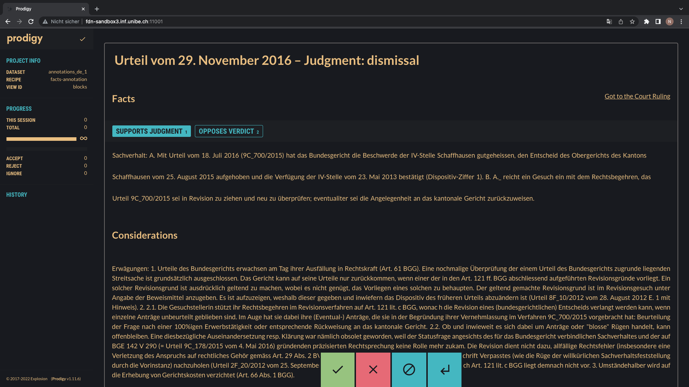
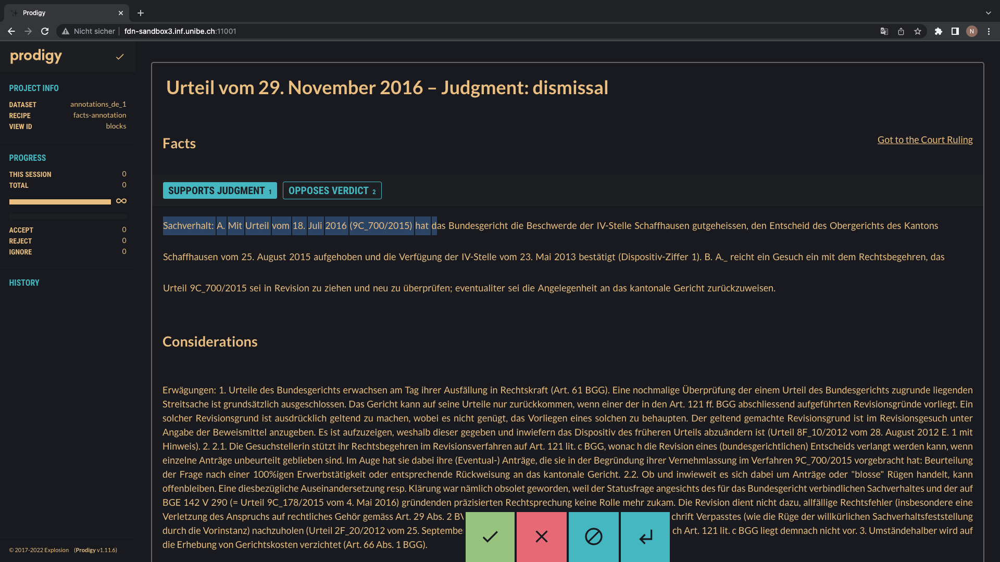
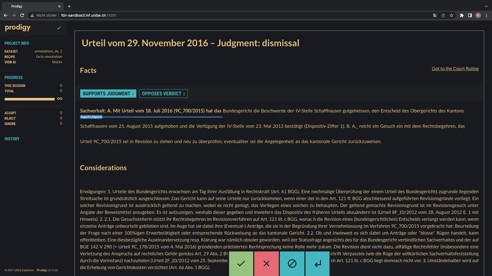
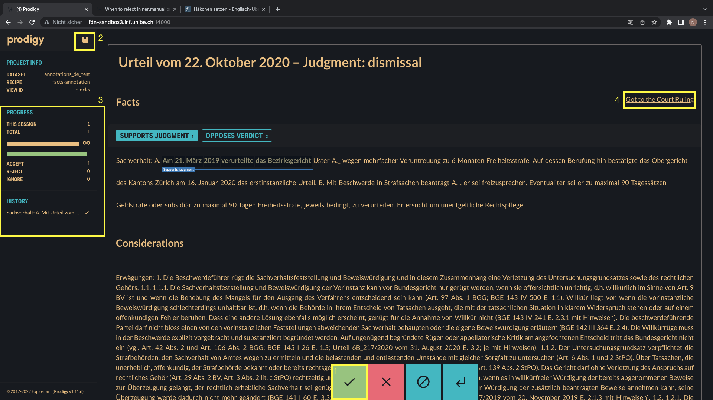

# How to annotate the dataset using prodigy
This manual should help you to complete the annotation task described in the annotation Guidelines for the Explainability Annotations for Legal Judgment Prediction in Switzerland. 
For this task we used the tool [prodigy](https://prodi.gy/) and built a custom recipe which lets you annotate the facts section of a given court decision.
## Access
The prodigy instance can only be accessed via the University of Bern Network. If you want to annotate from home you must use the [VPN of the University of Bern](https://serviceportal.unibe.ch/sp?id=kb_article_view&sys_kb_id=00cb11e51b005050134ddc6a9b4bcb49).
If you are connected to the University Network you can access prodigy via one of the following URLs:
- Angela: http://fdn-sandbox3.inf.unibe.ch:11001/
- Lynn: http://fdn-sandbox3.inf.unibe.ch:11002/
- Thomas: http://fdn-sandbox3.inf.unibe.ch:11003/
- FR-Annotations: http://fdn-sandbox3.inf.unibe.ch:12000/
- IT-Annotations: http://fdn-sandbox3.inf.unibe.ch:13000/

Before you can start you will be asked to provide a username and a password:
```
USERNAME: prodigy
PASSWORD: annotator
```
You should now see an overview of the case:

## Annotating
You can now start to annotate the fact section. To label a word or phrase with a tag highlight it with your cursor and choose the corresponding label. To delete a tagging simply click on the tagged words again. 

|  |  |
|---|---|

If you are happy with your annotation you can accept it by clicking on the green check __[1]__ and save it by pressing the save button in the left corner __[2]__.
To see your progress you can look at __[3]__ and if you want to access the original document you can click on the link in the rigth corner __[4]__. Please do not forget to safe your progress



If a case is badly tokenized (meaning the words are not properly separated) please press the red cross to reject it. If a case is to short or otherwise unfit for the annotation please comment your reasoning in the comment section and ignore it using the blue button with stop signal.

If you have any other questions or find any errors in these instructions, on prodigy or in the Annotation guidelines while doing the annotation please feel free to contact me.