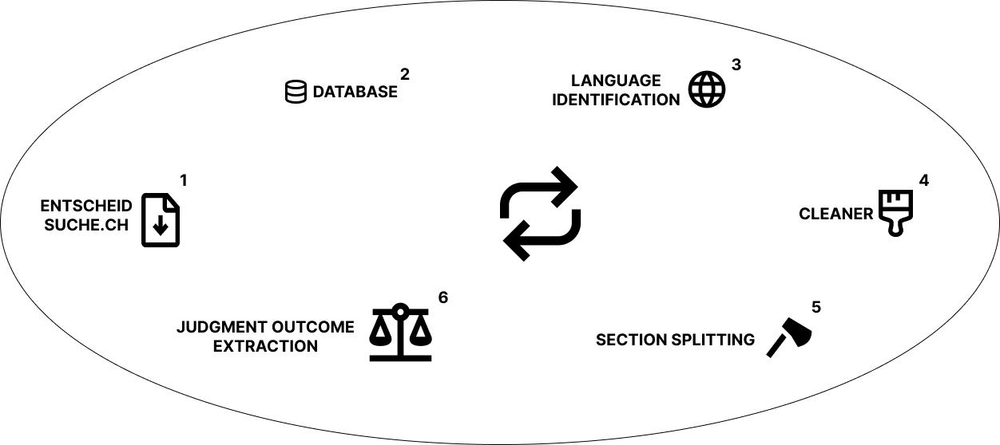

# This README introduces the workflow of the SwissCourtRulingCorpus

### The required steps leading to the extraction of the judgment outcome for a given case document can be described in six steps. The order of tasks usually follow the numeration depicted in the figure below, yet can vary as every step can be executed in isolation.

 

    

## 1. Scraping

Entscheidsuche.ch updates their website daily with all publicly available caseses from the courts in Switzerland. Per default, only case documents which do not already exist locally are considered in order to avoid rewriting the entire database.
In a first step, all the files are scraped including the associated metadata of every court's folder from entscheidsuche.ch/docs. A combination of BeautifulSoup's parsing library and Requests is used to extract the complete list of URLs to each of the case documents. The list is then iterated to download all the files.

## 2. Language identification

Since within a Swiss court case documents can vary in the language they are written in, every case must have assigned an appropriate language identifier which will be needed for the section splitting and judgment outcome extraction task. For every document within our database for which we were unable to extract the corresponding language from the metadata, we make use of the fastText language identification tool to assign to each the appropriate language id.

## 3. Cleaner

Certain courts may include strange patterns or unnecessary text within their case documents which can make the entire process more prone to errors. To improve further processing, cleaning functions for certain courts have been implemented removing such patterns and texts. The cleaners can be found in the **_cleaning_regexes.json_** file.

## 4. Section Splitting

The section splitting task serves the purpose of splitting the case ruling in its predefined sections. It is done so by defining a set of regex indicators, each of which implicate the start of one of the sections.
The composition of words and special characters to indicate certain sections however, may differ for each court in Switzerland. Thus for every Swiss court, a different set of regex indicators has to be defined for each section which may appear within a ruling.

Given a case document, it is first broken down into its paragraphs. Using the set of regex indicators we iterate through each paragraph and search for a match. Once a match has been found, all subsequent paragraphs are appended to the specific section until we find a new match. We continue this process until we reach the end of the file.

### _Section splitting helper module: pattern\_extractor.py_

The main issue facing the section splitting task lies in the wide variety of words used to indicate the start of each section and the different variations and additives these words may encompass. Not only may courts amongst themselves use different variations but this can also occur within the same court. Because of this, a manual extraction of indicators for a single court may require hours of structural analysis of different case rulings within that court.
In order to significantly reduce manual analysis while addressing maintainability for future courts and cases, a python module has been implemented which presents common indicators for a specific court for each section.
It works by counting the occurrence of every paragraph appearing across all case rulings for a given court. If a court has certain patterns of indicating different sections in certain ways, those will be reflected by having a significantly higher occurrence count than a random paragraph appearing within a case ruling. Using this logic we can then filter out low occurrence paragraphs and make rough assignment choices by having a baseline of predetermined common indicators for each section. The result is an accurate overview of all appearing patterns of indicators for each of the sections.

_The pattern\_extractor.py module can also be used to output the coverage of courts and their sections by executing the module with an argument. Refer to the module for further information._  

_Top four entries for consideration section of Verwaltungsgericht Bern_

| total count | indicator                            | coverage (\%) |
|-------------|--------------------------------------|---------------|
| 7160        | Erwägungen:                          | 95.51         |
| 125         | Der Einzelrichter zieht in Erwägung: | 1.67          |
| 94          | Sachverhalt und Erwägungen:\_        | 1.25          |
| 56          | Der Einzelrichter zieht in Erwägung, | 0.75          |

## 5. Judgment outcome extraction

The judgment outcome extraction step serves the purpose of extracting the judgment outcome based on a set of predefined indicators.

In order to map a ruling to one of the defined judgment outcomes, a set or combination of words is defined for each one of them. Since the meaning and implication of the words stay consistent across different courts, the same indicators can be used for all of them. As the indicators for the different judgment outcomes are not exclusive to this context, it is critical to consider only the ruling section of a case to avoid false positives as much as possible. A successful judgment outcome extraction therefore goes hand in hand with a precise section splitting. 

### _Judgment outcome helper module: judgment\_pattern\_extractor.py_

A helper method similar to the section splitting can be used for the extraction of indicators in the judgment outcome task. Instead of looking at whole paragraphs however, the ruling section of each case will be split into different set of n-grams and compared to each other.
Patterns which tend to remain consistent across many cases within a court will have a significantly higher occurrence count. These consistencies will primarily be the indicators responsible for the judgment outcome. 

_The judgment\_pattern\_extractor.py module can also be used to output the coverage of courts and their judgment outcome by executing the module with an argument. Refer to the module for further information._  

_Top six entries for a combination of three neighboring words for the cantonal court of Vaud_.

| total count | indicator                           |
|-------------|-------------------------------------|
| 22145       | ('Le', 'recours', 'est')            |
| 12292       | ('recours', 'est', 'rejeté.')       |
| 4238        | ('recours', 'est', 'admis.')        |
| 1971        | ('recours', 'est', 'irrecevable.')  |
| 1493        | ('recours', 'est', 'partiellement') |
| 1422        | ('est', 'partiellement', 'admis.')  |

## Verification

The coverage\_verification.py module can be used to output x amount of cases with their respective sections and judgment outcomes as a docx file to quickly scim through the decisions and verify them on their correctness. Refer to the module for further information.